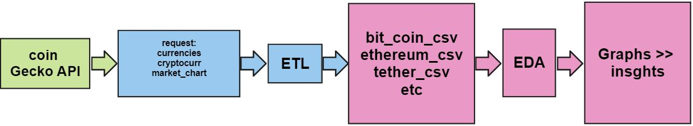

# Cryptocurrency Exploratory Data Analysis (EDA)

This repository contains exploratory data analysis (EDA) for cryptocurrencies. The EDA is performed on data extracted from CoinGecko using an ETL process. The analysis focuses on defining Key Performance Indicators (KPIs) to aid decision-making in the cryptocurrency market.

## Contents

- [ETL](eda_gecko.ipynb): Jupyter Notebook for extracting data from CoinGecko and preparing it for analysis.
- [EDA](etl_for_eda.ipynb): Jupyter Notebook for exploratory data analysis, including the development of KPIs.
- [data/](data/): Folder containing the extracted and preprocessed data.

## Getting Started

1. Clone the repository:

   ```bash
   git clone https://github.com/someonefrom93/PIDA_J_DIEGO.git
   cd PIDA_J_DIEGO

Install the required packages by creating a virtual environment and installing dependencies:

`python -m venv venv
source venv/bin/activate  # On Windows, use: venv\Scripts\activate
pip install -r requirements.txt`

## Open and run the ETL and EDA notebooks in a Jupyter environment.

About the Analysis
- The ETL.ipynb notebook extracts data from CoinGecko API and preprocesses it for analysis.

        You will find this pipeline in the notebook 
        

- The EDA.ipynb notebook focuses on exploratory data analysis, including the creation and analysis of Key Performance Indicators (KPIs).
KPIs developed include 

        This begins from ploting only price, market capitalization, and total volumes across time. Due to my limited familarity with the topic, as well as time and tasks administration, this only focused on the feature mentioned.

        - Price: is the value once the coin is appraised in specifict period of time.
        - Market capitalization: the coins in circulation supply multiplied by the crypto coin price.
        - Total Volume: It represents the total amount of a specific cryptocurrency traded on exchanges within a certain period of time

        We'll be exploring:

        - Outliers
        - Null values
        - Ranges of each coin
        - Volatility
        - Patterns across time
        - Corralation between currencies

Finally the KPIs chosen for decission making are going to be:

* Sharpe Ratio: This will throws values accordingly to risk management and date ranges
* Price-to-Market Capitalization Ratio:  It gives an indication of how much market capitalization is assigned to each unit of the cryptocurrency's circulating supply.
* Volume-to-Market Cap Ratio: It shows how much trading volume is occurring in relation to the overall market value of the cryptocurrency.


